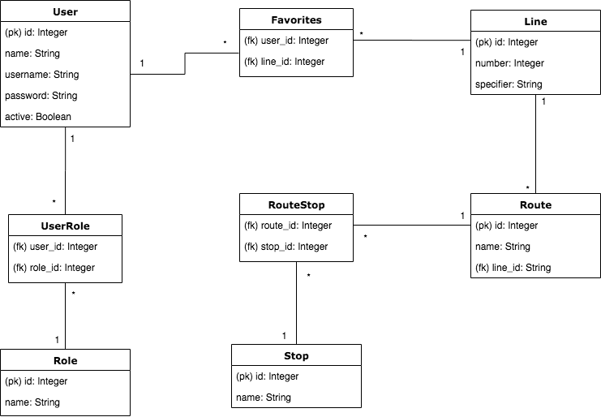

# Reitit

Reitit-sovelluksella hallitaan julkisen liikenteen linjoja ja niiden reittejä sekä reitteihin
liittyviä pysäkkejä. Lisäksi kirjautunut käyttäjä voi lisätä usein käyttämiänsä linjoja
suosikkeihinsa.

Linjat, reitit ja pysäkit näkyvät kaikille sovelluksen käyttäjille. Kirjautuneen käyttäjän lisäämät
suosikit näkyvät ainoastaan kyseiselle käyttäjälle. Ylläpitäjä voi luoda ja muokata linjoja,
reittejä ja pysäkkejä.

## Asentaminen

1. Luo ja aktivoi virtuaalinen ympäristö `venv` projektin hakemistossa.
2. Asenna sovelluksen riippuvuudet:

```bash
pip install -r requirement.txt
```

3. Aja sovellusta käynnistämällä Pythonissa projektin juuressa oleva `run.py`-tiedosto.

## Demo

Sovellusta voi koekäyttää Herokussa.

- [Heroku (tsoha-reitit)](https://tsoha-reitit.herokuapp.com/)

### Testitunnukset

- Ylläpito-oikeudet: käyttäjätunnus `admin`, salasana `Admin1`
- Normaali käyttäjä: käyttäjätunnus `normal`, salasana `Normal1`

## Dokumentaatio

- [Tietokantakaavio](documentation/tietokantakaavio.png)
- [Käyttötapaukset](documentation/kayttotapaukset.md)

### Tietokantakaavio


